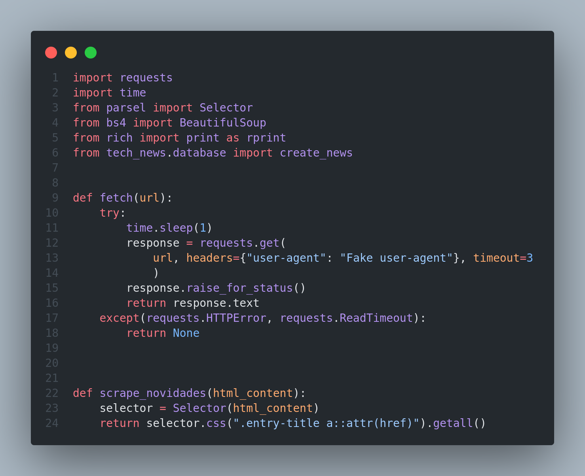

# Olá, tudo bem?

#### Fiz esse projeto durante meu período na Trybe e ele consiste em Data scraping ou Raspagem de Dados
#### Mas o que é essa tal de Raspagem de Dados?
#### A raspagem de dados, em sua forma mais geral, é uma técnica na qual um programa de computador extrai dados dos resultados gerados por outro programa. A raspagem de dados geralmente se manifesta na forma de raspagem da internet, que é o processo de usar um aplicativo para extrair informações valiosas de um site.

#### Foi-se utilizado o site de notícias da <a href="https://blog.betrybe.com/" target="_blank">Trybe<a/> nesse projeto como "cobaia" rsrs

#### Trecho do código:

